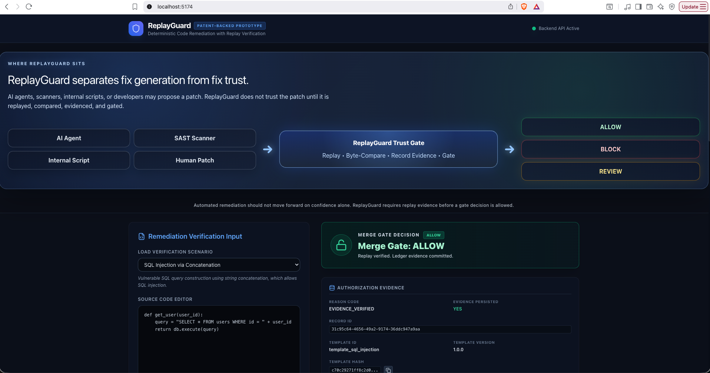
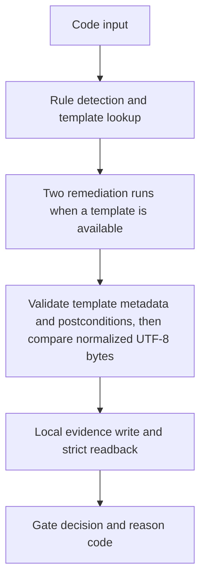

# ReplayGuard

[](https://github.com/apurvgaurav/replayguard-deterministic-remediation/actions/workflows/ci.yml)

A patent-backed prototype for evidence-gated verification of deterministic code remediation. This repository demonstrates selected concepts associated with issued U.S. Patent US 12,670,085 B1. It is an explanatory prototype rather than a production security product.

## Reviewer Preview



*ALLOW scenario showing the active backend, trust-gate decision, and reviewer-facing authorization evidence. BLOCK and REVIEW are available as separate built-in scenarios.*

## Technical Thesis

A proposed remediation remains untrusted until both runs generate patches from consistent template identity, version, and canonical hash; both satisfy the configured postconditions; their normalized UTF-8 outputs match byte-for-byte; and the evidence record is successfully persisted and verified by strict readback.

## Core Authorization Invariant

```text
ALLOW =
  rule matched
  AND template applied
  AND template ID, version, and hash consistent across both runs
  AND both runs generated patches and passed configured postconditions
  AND normalized run 1 UTF-8 bytes == normalized run 2 UTF-8 bytes
  AND evidence persistence verified
```

If any required ALLOW condition fails, ReplayGuard must not return ALLOW.

## Decision Contract

| Decision | Reason Code | Description |
| :--- | :--- | :--- |
| **ALLOW** | `EVIDENCE_VERIFIED` | Rule matched, both runs generated patches with consistent template metadata, configured postconditions passed, normalized UTF-8 outputs matched byte-for-byte, and evidence persistence was verified. |
| **BLOCK** | `REPLAY_MISMATCH` | Rule matched and both runs satisfied the configured template postconditions, but their normalized UTF-8 outputs did not match byte-for-byte. |
| **BLOCK** | `TEMPLATE_ATTESTATION_FAILED` | Rule matched and a template was selected, but one or both runs failed patch generation, template ID/version/hash consistency, or configured postcondition validation. |
| **BLOCK** | `EVIDENCE_PERSISTENCE_FAILED` | All authorization checks passed, but the local evidence write, replacement, or strict readback verification failed. |
| **REVIEW** | `NO_TEMPLATE` | Rule matched, but no deterministic remediation template is configured for the rule. |
| **REVIEW** | `NO_RULE_MATCH` | No vulnerability signature/rule matched the input code. |

## Verification Workflow



## Implemented Prototype Features

* **FastAPI Backend**: Hosts the analysis, remediation, replay, comparison, and local evidence-ledger APIs.
* **React/Vite Frontend**: Reviewer dashboard for running scenarios and inspecting evidence.
* **Vulnerability Rules**: Selected Python rules (SQL injection, hardcoded secrets, unsafe shell).
* **Deterministic Templates**: Remediation templates featuring versioning and exact match-count enforcement.
* **Replay Template Attestation**: Requires both runs to produce patches, report matching template ID, version, and canonical hash, and satisfy the configured postconditions.
* **Normalized UTF-8 Byte Comparison & SHA-256 Hashes**: Normalizes line endings, removes trailing whitespace from each line and leading/trailing blank lines, compares the resulting UTF-8 bytes exactly, hashes both normalized outputs, and produces a unified diff when they differ.
* **Controlled Fault Injection**: Explicitly appends a randomized controlled-fault marker to Run 2 for mismatch testing.
* **Local JSON Persistence**: Uses a same-process lock, same-directory temporary file, file flush and `fsync`, and `os.replace`.
* **Strict Readback Verification**: Re-reads the newest persisted record, recomputes its evidence-record hash, and verifies its record ID, stored hash, timestamp, and evidence-persisted flag against the expected values.
* **Evidence-Record Hash Recomputation**: Recomputes the SHA-256 record hash from the selected persisted evidence fields during strict readback.
* **UTC Timestamps & Record IDs**: Unique UUIDs and ISO 8601 timestamps for each evidence run.
* **Automated GitHub Actions CI**: Continuous validation of tests and production builds.

*Note: The prototype does not implement formal verification, semantic equivalence proofs, process-level isolation, digital signatures, or immutable or tamper-evident ledger storage.*

## Evidence Record Schema

| Field | Type | Description |
| :--- | :--- | :--- |
| `record_id` | `string` | Unique UUID generated for the run. |
| `timestamp` | `string` | ISO 8601 UTC timestamp. |
| `original_code_hash` | `string` | SHA-256 hash of the input code. |
| `rule_id` | `string \| null` | ID of the matched rule. |
| `template_id` | `string \| null` | ID of the applied template. |
| `template_version` | `string \| null` | Configured template semantic version. |
| `template_hash` | `string \| null` | SHA-256 hash of the canonical template definition. |
| `patch_run_1_hash` | `string \| null` | SHA-256 hash of the normalized first remediation output. |
| `patch_run_2_hash` | `string \| null` | SHA-256 hash of the normalized second remediation output. |
| `template_postconditions_passed` | `boolean \| null` | Aggregate replay-template attestation result covering patch generation, template ID/version/hash consistency, and configured postconditions. |
| `reason_code` | `string \| null` | Specific rationale for the gate decision. |
| `gate_decision` | `string` | Final gate status (`ALLOW`, `BLOCK`, `REVIEW`). |
| `evidence_persisted` | `boolean` | Indicates whether the local JSON write and strict readback verification succeeded. |
| `ledger_hash` | `string` | SHA-256 hash over the selected evidence fields used by the current record-hash payload. |

*Note: The `ledger_hash` is an unkeyed evidence-record hash. It is not a digital signature and does not authenticate the record against an attacker who can rewrite both the record and its hash.*

## Demonstration Scenarios

| Scenario | Decision | Details |
| :--- | :--- | :--- |
| **SQL Injection via Concatenation** | `ALLOW` | Rule matches, the parameterized remediation template is applied, postconditions pass, and both normalized remediation outputs match byte-for-byte. |
| **Hardcoded API Key Credential** | `ALLOW` | The secret is replaced with an environment-variable lookup, postconditions pass, and both normalized remediation outputs match byte-for-byte. |
| **Unsafe Shell Execution** | `ALLOW` | The shell invocation is replaced with list-based subprocess execution, postconditions pass, and both normalized remediation outputs match byte-for-byte. |
| **Replay Mismatch** | `BLOCK` | Controlled fault injection appends a randomized marker to Run 2, causing the normalized UTF-8 outputs to differ. |
| **Unsafe eval** | `REVIEW` | The rule matches, but no template is configured, so the change is routed to human review. |

## Verification Results

* **28 Backend Tests**: Test coverage includes gate authorization, persistence failures, template semantics, concurrent writes, replay mismatch, hash verification, and REVIEW paths.
* **Python Matrix**: CI runs the backend test suite on Python 3.9 and 3.12.
* **Frontend Build**: Verified production Vite bundling in CI.
* **Demo Safety**: CI verifies that `backend/app/demo_data/ledger_history.json` is not modified by tests.
* **Test Isolation**: Backend tests write to temporary directories.

Verify the workflow details in [.github/workflows/ci.yml](.github/workflows/ci.yml).

## Reproduce Locally

Clone the repository and run backend tests:
```bash
git clone https://github.com/apurvgaurav/replayguard-deterministic-remediation.git
cd replayguard-deterministic-remediation
python3 -m venv backend/.venv
source backend/.venv/bin/activate
python -m pip install -r backend/requirements.txt
backend/.venv/bin/python -m pytest -q backend
```
*Expected output: `28 passed`*

Start the backend:
```bash
backend/.venv/bin/python -m uvicorn app.main:app --reload --port 8000 --app-dir backend
```
*FastAPI documentation is available at http://127.0.0.1:8000/docs.*

Start the frontend in a second terminal:
```bash
cd frontend
npm ci
npm run dev
```
*Vite prints the local URL to access the dashboard.*

To verify the production build:
```bash
npm run build
```

## API Surface

* `GET /api/health`: Health status.
* `GET /api/scenarios`: Available demo scenarios.
* `POST /api/scan`: Submits code for scanning, remediation, and gating.
* `GET /api/ledger`: Retrieves evidence history.
* `POST /api/ledger/clear`: Clears local evidence records.

## Repository Map

* [backend/app/](backend/app/): Main application code, local demo data, services, models, and template engine.
* [backend/tests/](backend/tests/): Test suite for gate invariants, verification, and templates.
* [frontend/](frontend/): React / TypeScript dashboard interface.
* [docs/](docs/): Architectural diagrams, differentiated goals, and product briefings.
* [examples/](examples/): Reference integration patterns.
* [assets/](assets/): Static visual assets.

## Technical Boundaries

* **Local JSON Evidence File**: Evidence is stored in a local JSON file, not in an immutable or externally administered evidence store.
* **No Digital Signatures**: Record hashes are unkeyed integrity checks over selected fields and do not authenticate records.
* **No Tamper-Evident Chain**: Records are not cryptographically chained to earlier records.
* **In-Process Replay**: Both remediation runs execute inside the same runtime process.
* **Simple Rule Engine**: The scanner demonstrates the workflow and is not a complete SAST or taint-analysis engine.
* **Not a Semantic Proof**: Structural postconditions validate configured patterns; they do not prove semantic equivalence or security.
* **Application-Level Gate**: The API returns a gate decision, but ReplayGuard is not currently installed as a required GitHub branch-protection check.
* **No Security Guarantee**: An ALLOW decision means the configured prototype checks passed; it does not prove that the code is secure.
* **Production Work Required**: A production system would require isolated execution, durable external evidence storage, stronger parsing and policy enforcement, broader evaluation, access controls, and independent security review.

## Patent Relationship

ReplayGuard demonstrates selected implementation concepts associated with issued U.S. Patent US 12,670,085 B1, “Deterministic Offline Code Remediation with Ledger-Verified Replay and Template-Based Patch Generation.”

This repository is a prototype designed to illustrate core flows. The implementation does not define the full legal scope of the patent, and this documentation is not a claim chart.

## Technical Documents and Examples

* [validation-plan.md](docs/validation-plan.md)
* [architecture.md](docs/architecture.md)
* [limitations.md](docs/limitations.md)
* [executive-one-pager.md](docs/executive-one-pager.md)
* [differentiation.md](docs/differentiation.md)
* [agent_patch_request.json](examples/ai-agent/agent_patch_request.json)
* [sample-pr-gate-output.md](examples/cicd/sample-pr-gate-output.md)

ReplayGuard’s purpose is not to automate every fix; it is to require reproducible evidence before an automated fix is authorized to move forward.
