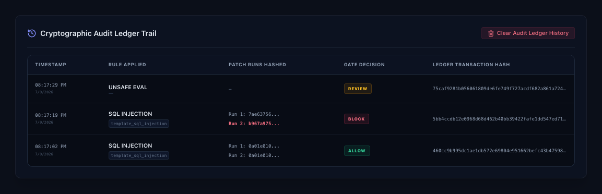

# ReplayGuard

ReplayGuard is a patent-backed prototype for evidence-backed verification of automated code remediation. It is based on selected ideas from my issued U.S. Patent **US 12,670,085 B1**.

I built it to make one idea visible:

> An automated code fix should not move forward just because it looks correct. It should be replayed, compared, and recorded first.

The prototype demonstrates deterministic code remediation with replay verification, byte-level comparison, ledger-style evidence, and merge gate decisioning.

This is not a production security product. It is a focused prototype to show the core workflow behind the patent.

---


## Demo Preview



---


## Why ReplayGuard is Different

ReplayGuard is not another code scanner and it is not another AI code generator.

Existing tools usually focus on finding issues, suggesting fixes, or running tests. ReplayGuard focuses on a different question:

> Can an automated fix prove that it is reproducible before it is trusted?

An AI tool, scanner, internal script, or human developer may propose a remediation. ReplayGuard treats that remediation as untrusted until it can be replayed, compared byte-for-byte, recorded as evidence, and gated.

This makes ReplayGuard a verification layer around automated remediation.

---

## Why This Matters Now

AI-assisted development is making code changes faster. That speed is useful, but it creates a trust problem.

If automated remediation enters software delivery workflows, teams need to know:

- Was the issue actually detected?
- What rule or template produced the fix?
- Can the same fix be reproduced?
- Did replay outputs match exactly?
- Was evidence recorded before allowing the change?
- Should the change be allowed, blocked, or routed to human review?

ReplayGuard demonstrates this trust gate.

---

## Integration Patterns

ReplayGuard can be understood in four ways:

1. Dashboard demo for visual explanation
2. API-based verification service
3. SDK-style developer integration
4. CI/CD merge gate for automated remediation workflows

The current prototype demonstrates the core verification workflow. The `examples/` folder shows how the same pattern could be used in real engineering environments.

Current example patterns include:

- API scan request and sample ALLOW / BLOCK responses
- SDK-style developer workflow
- CI/CD gate example
- mobile/API secret remediation example
- AI-agent patch verification example
- enterprise buyer use cases

---


## Strategy Documents

- [Executive one-pager](docs/executive-one-pager.md)

- [Audience and product strategy](docs/audience-and-product-strategy.md)

- [Executive Brief](docs/executive-brief.md)
- [Product Vision](docs/product-vision.md)
- [Differentiation](docs/differentiation.md)
- [Professor Brief](docs/professor-brief.md)
- [Architecture](docs/architecture.md)
- [Limitations](docs/limitations.md)

---

## Example Integration Patterns

- [API examples](examples/api/)
- [SDK-style example](examples/sdk/python_sdk_example.py)
- [CI/CD gate example](examples/cicd/)
- [Mobile/API secret example](examples/mobile/)
- [AI-agent verification example](examples/ai-agent/)
- [Enterprise buyer use cases](examples/enterprise/buyer-use-cases.md)

---


## Prototype Scope vs. Product Roadmap

The current prototype is intentionally focused.

It proves the core trust-gate workflow:

detect issue
→ apply deterministic remediation
→ replay remediation
→ compare outputs
→ record evidence
→ return ALLOW, BLOCK, or REVIEW

The prototype does **not** claim to be a full mobile application, published SDK, production CI/CD plugin, complete SAST engine, or production security platform.

That is intentional.

The MVP proves the verification pattern. The product roadmap expands the surfaces around it.

### What the prototype shows today

- dashboard demo
- backend API
- selected deterministic remediation scenarios
- replay verification
- byte-level comparison
- ledger-style evidence
- ALLOW / BLOCK / REVIEW gate decisions
- example patterns for API, SDK, CI/CD, mobile/API, AI-agent, and enterprise use cases

### What comes next

- real GitHub Action or CI/CD plugin
- published SDK package
- stronger parser, AST, and taint-flow analysis
- broader language and vulnerability coverage
- signed or external evidence ledger
- policy engine for enterprise gates
- benchmark evaluation on real-world repositories
- deeper AI-agent remediation verification

The current version is narrow by design. The product thesis is broader:

> automated remediation should not be trusted until it can be replayed, compared, evidenced, and gated.

---

## Why I built this

AI-assisted software development is moving fast. Code can now be generated, changed, and remediated very quickly.

That creates a trust problem.

Before an automated fix is accepted, I want to know:

- What issue was detected?
- What rule or template created the fix?
- Can the same fix be reproduced?
- Did both remediation runs match byte-for-byte?
- Was evidence recorded before the change moved forward?

ReplayGuard is my prototype for exploring that workflow.

The main point is simple:

> Faster code changes need stronger evidence before they are trusted.

---

## What the prototype does

ReplayGuard takes a code sample and runs it through this flow:

```text
Code input
→ rule detection
→ deterministic remediation template
→ patch run 1
→ patch run 2
→ byte-level comparison
→ ledger evidence
→ merge gate decision
The gate decision can be:

* ALLOW — replay matched and evidence was recorded
* BLOCK — replay mismatch was detected
* REVIEW — an issue was detected, but no deterministic remediation template was available

⸻

Demo scenarios

The current prototype supports five scenarios:

1. SQL Injection via Concatenation → ALLOW
2. Hardcoded API Key Credential → ALLOW
3. Unsafe Shell Execution → ALLOW
4. Replay Mismatch - Block Merge → BLOCK
5. No Template - Human Review Required → REVIEW

I included both success and failure paths because a trust gate should not only approve changes. It also needs to block or route work to review when evidence is not strong enough.

⸻

What is real in this prototype

This prototype currently includes:

* FastAPI backend
* React/Vite frontend
* Frontend connected to backend APIs
* Rule-based detection for selected scenarios
* Deterministic remediation templates
* Independent patch run 1 and patch run 2
* Byte-level comparison
* SHA-256 hash generation
* Ledger-style audit records
* ALLOW, BLOCK, and REVIEW gate decisions
* Backend tests for success, mismatch, and review scenarios

Current backend test status:
7 passed
What is simplified

This is a prototype, not a full production SAST or DevSecOps platform.

The current version is intentionally narrow:

* It supports selected Python examples only
* The rule engine is simple
* The remediation templates are demo templates
* The ledger is local demo storage
* CI/CD is represented as a merge gate decision, not a live pipeline integration
* It does not guarantee that code is secure

That scope is intentional. The goal is to demonstrate the replay-verification workflow clearly before expanding the system.

⸻

Architecture

ReplayGuard has two main parts:
backend/   FastAPI service for scanning, remediation, replay, comparison, ledger, and gate decisions
frontend/  React/Vite dashboard for running scenarios and viewing evidence
docs/      Architecture, walkthrough, demo script, limitations, and professor brief
assets/    Screenshots and visual artifacts
Main backend endpoints:
GET  /api/scenarios
POST /api/scan
GET  /api/ledger
POST /api/ledger/clear
GET  /api/health
Run locally

Backend
cd backend
source venv/bin/activate
uvicorn app.main:app --reload --port 8000
API docs:
http://127.0.0.1:8000/docs
Frontend
cd frontend
npm install
npm run dev
Frontend runs on the port shown by Vite, usually:
http://localhost:5174/
Run tests
cd backend
source venv/bin/activate
pytest
Expected result:
7 passed
Screenshots

Final demo screenshots are stored under:
assets/screenshots/final/
Recommended screenshot set:
01-home-backend-active.png
02-sql-injection-allow-main.png
02-sql-injection-allow-replay-ledger.png
03-hardcoded-secret-allow-main.png
03-hardcoded-secret-allow-replay-ledger.png
04-unsafe-shell-allow-main.png
04-unsafe-shell-allow-replay-ledger.png
05-replay-mismatch-block-main.png
05-replay-mismatch-block-replay-ledger.png
06-no-template-review-main.png
06-no-template-review-replay-ledger.png
07-clean-ledger-allow-block-review.png
Known limitations

ReplayGuard demonstrates the core idea, not the full future system.

A production version would need:

* deeper parsing
* stronger AST and taint-flow analysis
* broader language support
* real CI/CD integration
* signed or external ledger storage
* stronger policy controls
* larger test coverage
* security review

I am keeping the current prototype focused because the first job is to make the replay-verification concept easy to understand and easy to inspect.
Patent reference

This prototype is based on selected concepts from my issued U.S. Patent:

US 12,670,085 B1 — Deterministic Offline Code Remediation with Ledger-Verified Replay and Template-Based Patch Generation

The prototype is a public demonstration of selected ideas from the patent. It is not presented as a production system.
Author note

I built ReplayGuard to make the patent easier to understand as a working system.

The broader direction I am exploring is evidence-backed software automation: how automated code changes can be verified before they are trusted, especially as AI-assisted development becomes more common.

My goal with this prototype is not to claim that every code issue can be fixed automatically. The goal is to show a more disciplined workflow:

detect the issue, apply a deterministic fix, replay it, compare it, record evidence, and only then decide whether the change should move forward.
